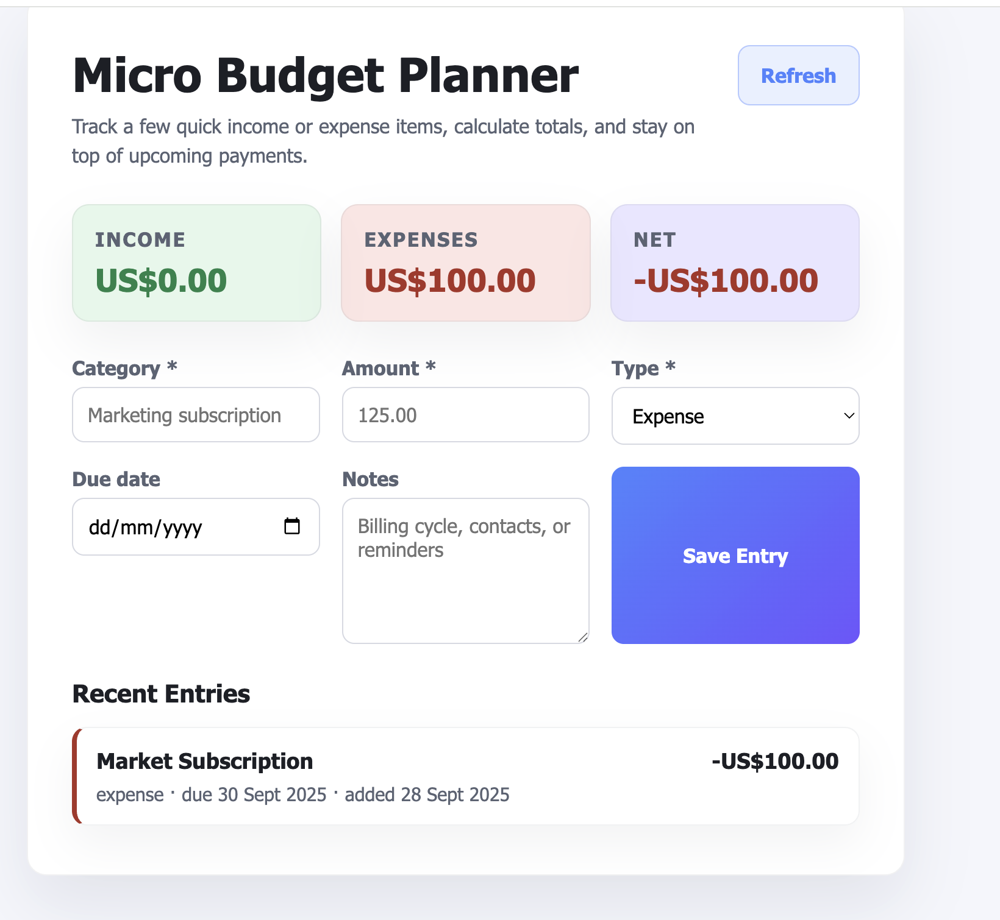
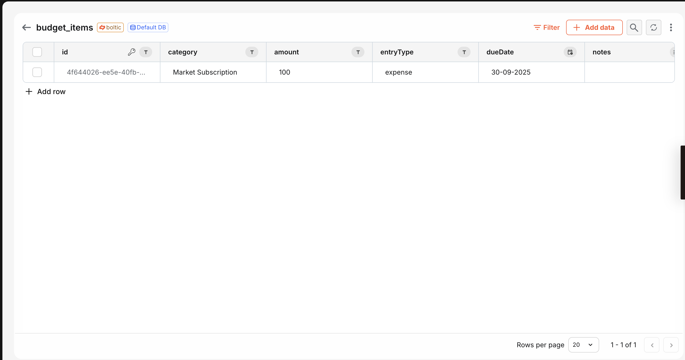

# Example: Budget Planner App with Boltic Database SDK

Build a lightweight finance tracker on top of the Boltic Database SDK. This blueprint gives you a responsive UI, rolling summaries, and REST endpoints so you can capture income and expenses from any device.

## 🚀 Try It Out

**Live Demo:** [https://budget-app-d9ddc9d7.serverless.boltic.app/](https://budget-app-d9ddc9d7.serverless.boltic.app/)

Test the budgeting workflow in your browser—the deployment showcases how Boltic handles table provisioning, record writes, and real-time totals.

### Budget Dashboard


_Add recurring bills, one-off expenses, and income entries while your totals update instantly._

### Data Storage in Boltic Database


_Each transaction is stored in Boltic, making it simple to trigger downstream reporting or automations._

## Why Boltic Database SDK?

Boltic SDK removes the boilerplate from database access. Initialize it with your API key and environment, then use intuitive helpers to create tables, insert records, and query data. Paired with Boltic Serverless, you can deploy production-grade finance tooling in minutes.

## How This Example Uses Boltic SDK

The handler provisions a `budget_items` table (when supported), serves the single-page UI, and exposes endpoints for inserting entries and fetching summaries.

```js
import { createClient } from '@boltic/sdk';

const boltic = createClient(process.env.BOLTIC_API_KEY, { environment: 'sit' });

// Record an expense
await boltic.records.insert('budget_items', {
  category: 'Marketing subscription',
  entryType: 'expense',
  amount: 125,
  dueDate: new Date('2024-05-31').toISOString(),
});
```

## Boltic SDK Functions Used in `handler.js`

- `createClient(apiKey, options)`: Initializes the SDK client.
- `client.tables.findByName(name)`: Detects whether the budget table already exists.
- `client.tables.create(schema)`: Creates the table with category, amount, entry type, due date, and notes columns.
- `client.records.insert(table, data)`: Stores income or expense entries.
- `client.records.findAll(table, options)`: Returns paginated entries along with server-side summaries.

## Requirements

- Node.js 18+
- Environment variables
  - `BOLTIC_API_KEY`: API token (e.g. `xxxxxxx-xxxx-xxxx-xxxx-xxxxxxxxxxxxx`)
  - `BOLTIC_BUDGET_TABLE` (optional): overrides the default `budget_items` table name
  - `BOLTIC_ENVIRONMENT` (optional): Boltic workspace environment (`sit`, `uat`, `prod`, …)

## Install & Local Test

```bash
cd nodejs/boltic-sdk/budget-app
npm install
npm start
```

## Deploy

- Use `blueprint.yaml` for deployment.

## Deploying on Boltic Serverless

Follow the standard Boltic workflow to publish this budgeting experience.

1. **Initialize a git repository**
   ```bash
   mkdir boltic-budget-app && cd boltic-budget-app
   git init --initial-branch=main
   git checkout -b main
   ```
2. **Add core files**
   - `handler.js`
   - `blueprint.yaml`
3. **Stage and commit files**
   ```bash
   git add handler.js blueprint.yaml
   git commit -m "Initial commit for budget app"
   ```
4. **Add the remote repository URL**
   ```bash
   git remote add origin git@ssh.git.boltic.io:<your-repo-id>/boltic-budget-app.git
   ```
5. **Push your changes**
   ```bash
   git push --set-upstream origin main
   ```
6. **Create the serverless app in Boltic Console**
   - Select "Hosted git" and provide your repo details
   - Choose Node.js 20 and configure environment variables

## Data Model

```json
{
  "category": "Marketing subscription",
  "entryType": "expense",
  "amount": 125,
  "dueDate": "2024-05-31T00:00:00.000Z",
  "notes": "Annual plan billed in May",
  "createdAt": "2024-05-12T09:30:00.000Z",
  "updatedAt": "2024-05-12T09:30:00.000Z"
}
```

## How to Use This Example

1. Copy the handler, static assets, and blueprint configuration.
2. Configure your Boltic API key (and optional environment/table overrides).
3. Run locally or deploy to Boltic Serverless to share the budgeting UI.
4. Extend the schema or UI—add tags, recurring reminders, or export features as needed.

Use this blueprint whenever you need a fast, data-driven budgeting workflow backed by the Boltic Database SDK.
