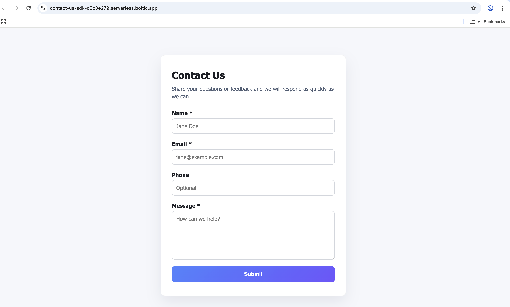
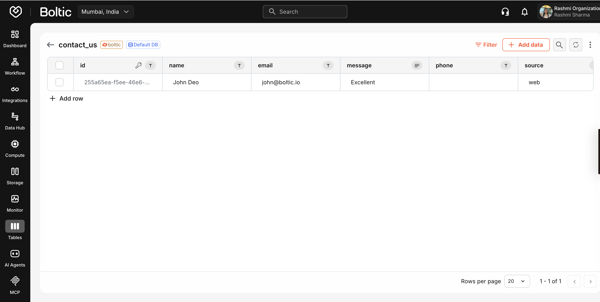

# Example: Contact Us Form Backend with Boltic Database SDK

Unlock the power of Boltic Database SDK to build and deploy serverless applications with minimal effort. This example shows how you can quickly create a backend for a contact form, and easily adapt or copy-paste the code to build your own data-driven apps.

## 🚀 Try It Out

**Live Demo:** [https://contact-us-sdk-c5c3e279.serverless.boltic.app/](https://contact-us-sdk-c5c3e279.serverless.boltic.app/)

Test the contact form in action! This live deployment demonstrates how the Boltic Database SDK seamlessly handles form submissions and stores them in a cloud database.

### Contact Form Interface


_The contact form interface with clean, user-friendly design_

### Data Storage in Boltic Database


_Contact submissions are automatically stored and can be viewed in the Boltic database interface_

## Why Boltic Database SDK?

Boltic SDK lets you interact with your cloud database using simple, intuitive methods—no complex setup required. You can store, query, and manage records in a serverless environment with just a few lines of code.

## How This Example Uses Boltic SDK

The backend uses [`@boltic/sdk`](https://www.npmjs.com/package/@boltic/sdk) to store and retrieve contact submissions. You can copy-paste this pattern for your own use case.

```js
import { Boltic } from '@boltic/sdk';
const boltic = new Boltic(process.env.BOLTIC_API_KEY, {});

// Save a contact submission
await boltic.records.insert('contact_us', { ... });
```

## Boltic SDK Functions Used in `handler.js`

- `Boltic(apiKey, options)`: Initializes the SDK client with your API key and environment.
- `boltic.records.insert(table, data)`: Inserts a new record into the specified table.
- `boltic.records.list(table, { limit, offset })`: Lists records from the table with pagination.
- `boltic.records.get(table, id)`: Fetches a single record by ID.
- `boltic.table.setup(table, schema)`: (Optional) Bootstraps the table schema if needed.

Each function is designed to make database operations simple and fast for serverless apps.

## Requirements

- Node.js 18+
- Environment variables
- `BOLTIC_API_KEY`: token (e.g. `xxxxxxx-xxxx-xxxx-xxxx-xxxxxxxxxxxxx`)
- `BOLTIC_CONTACT_TABLE` (optional): overrides the default table name `contact_us`

## Install & Local Test

```bash
cd contact-us
npm install
npm start
```

## Deploy

- Use `blueprint.yaml` for deployment.

## Deploying on Boltic Serverless

This folder is an example use case for Boltic Database SDK, showing how to deploy a Node.js backend on Boltic Serverless.

### Steps to Create & Deploy a Boltic Serverless App

1. **Initialize a git repository**
   ```bash
   mkdir new-serverless && cd new-serverless
   git init --initial-branch=main
   git checkout -b main
   ```
2. **Add core files**
   - `handler.js`: contains your serverless function code
   - `boltic.yaml`: configures the function and build settings
3. **Stage and commit files**
   ```bash
   git add handler.js boltic.yaml
   git commit -m "Initial commit for serverless"
   ```
4. **Add the remote repository URL**
   ```bash
   git remote add origin git@ssh.git.boltic.io:<your-repo-id>/new-serverless.git
   ```
5. **Push your changes**
   ```bash
   git push --set-upstream origin main
   ```
6. **Create the serverless app in Boltic Console**
   - Select "Hosted git" and provide your repo details
   - Choose language and configure environment variables

## Data Model

The handler writes records with the following shape:

```json
{
  "name": "Jane Doe",
  "email": "jane@example.com",
  "message": "Please reach out regarding pricing.",
  "submittedAt": "2024-05-20T13:37:00.123Z",
  "source": "web",
  "phone": "+1 555-0100"
}
```

## How to Use This Example

1. Copy the code and folder structure.
2. Update environment variables for your Boltic account.
3. Deploy using the provided steps and blueprint.

You can build similar applications by reusing the handler and configuration patterns shown here.
