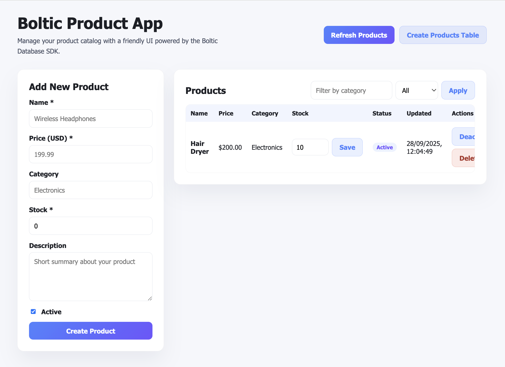
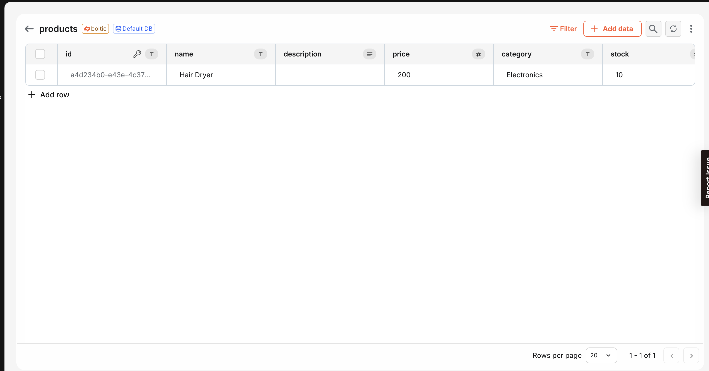

# Example: Product Management App with Boltic Database SDK

Showcase a complete product catalog—UI and API included—powered by the Boltic Database SDK. This blueprint lets you browse inventory, adjust stock, toggle availability, and keep everything synced with the Boltic platform.

## 🚀 Try It Out

**Live Demo:** [https://product-app-ca4eb7f9.serverless.boltic.app](https://product-app-ca4eb7f9.serverless.boltic.app)

Explore the hosted catalog manager to see how Boltic handles CRUD operations, inventory updates, and table provisioning end-to-end.

### Product Admin Console


_Add, update, filter, or delete products from a polished dashboard with inline stock controls and status badges._

### Boltic Database View


_Records created through the UI are immediately available in your Boltic database for downstream automations, reporting, or integrations._

## Why Boltic Database SDK?

Boltic SDK keeps database operations simple. Initialize the client with your API key, then call intuitive helpers for tables and records—no ORMs or boilerplate required. Pairing the SDK with Boltic Serverless gives you instant hosting, secrets management, and marketplace-ready blueprints.

## How This Example Uses Boltic SDK

The handler provisions a `products` table (when permitted), serves the single-page UI, and exposes CRUD endpoints that stay in sync with the app.

```js
import { createClient } from '@boltic/sdk';

const boltic = createClient(process.env.BOLTIC_API_KEY, {  });

// Save a product
await boltic.records.insert('products', {
  name: 'Wireless Headphones',
  price: 299.99,
  stock: 50,
  active: true,
});
```

## Boltic SDK Functions Used in `handler.js`

- `createClient(apiKey, options)`: Initializes the SDK with environment, retries, and debug flags.
- `client.tables.findByName(name)`: Looks up the products table by name.
- `client.tables.create(schema)`: Creates the table and column definitions if it is missing.
- `client.records.findAll(table, options)`: Retrieves products with pagination and optional filters.
- `client.records.findOne(table, id)`: Fetches a single product by identifier.
- `client.records.insert(table, data)`: Inserts a new product record.
- `client.records.updateById(table, id, data)`: Updates product fields such as stock or status.
- `client.records.deleteById(table, id)`: Removes a product.

## Requirements

- Node.js 18+
- Environment variables
  - `BOLTIC_API_KEY`: API token (e.g. `xxxxxxx-xxxx-xxxx-xxxx-xxxxxxxxxxxxx`)
  - `BOLTIC_TABLE_NAME` (optional): overrides the default `products` table name

## Install & Local Test

```bash
cd nodejs/boltic-sdk/product-app
npm install
npm start
```

## Deploy

- Use `blueprint.yaml` for deployment.

## Deploying on Boltic Serverless

This folder is a drop-in blueprint for Boltic Serverless. Follow the standard flow to publish your own catalog manager.

1. **Initialize a git repository**
   ```bash
   mkdir boltic-product-app && cd boltic-product-app
   git init --initial-branch=main
   git checkout -b main
   ```
2. **Add core files**
   - `handler.js`: serverless function
   - `blueprint.yaml`: runtime, CORS, and metadata configuration
3. **Stage and commit files**
   ```bash
   git add handler.js blueprint.yaml
   git commit -m "Initial commit for product app"
   ```
4. **Add the remote repository URL**
   ```bash
   git remote add origin git@ssh.git.boltic.io:<your-repo-id>/boltic-product-app.git
   ```
5. **Push your changes**
   ```bash
   git push --set-upstream origin main
   ```
6. **Create the serverless app in Boltic Console**
   - Select "Hosted git" and provide the repo details
   - Choose Node.js 20 and configure environment variables

## Data Model

```json
{
  "name": "Wireless Headphones",
  "description": "High-quality wireless headphones with noise cancellation",
  "price": 299.99,
  "category": "Electronics",
  "stock": 50,
  "active": true,
  "createdAt": "2024-05-01T12:00:00.000Z",
  "updatedAt": "2024-05-01T12:00:00.000Z"
}
```

## How to Use This Example

1. Copy the handler, UI assets, and blueprint configuration.
2. Set the environment variables for your Boltic account.
3. Deploy to Boltic Serverless or run locally for demos.
4. Extend the schema or UI (e.g. add pricing tiers, tags, or media) to match your product catalog.

Reuse this pattern whenever you need a managed CRUD experience backed by the Boltic Database SDK.
